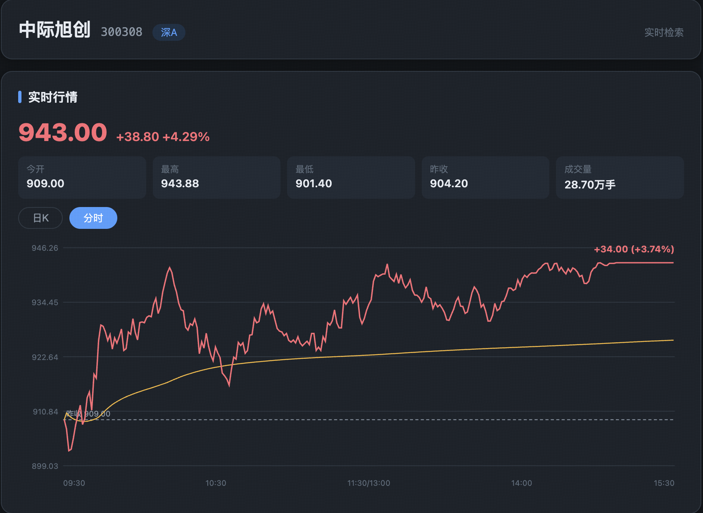
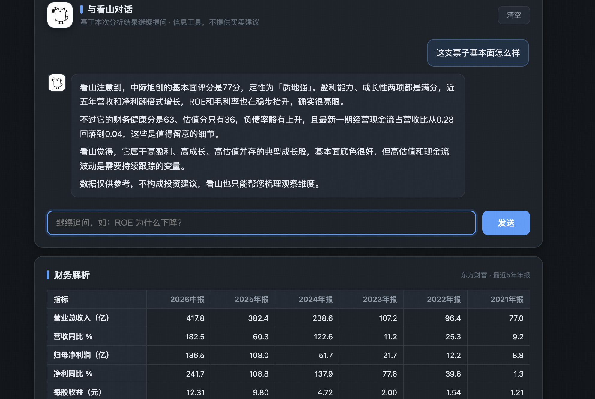
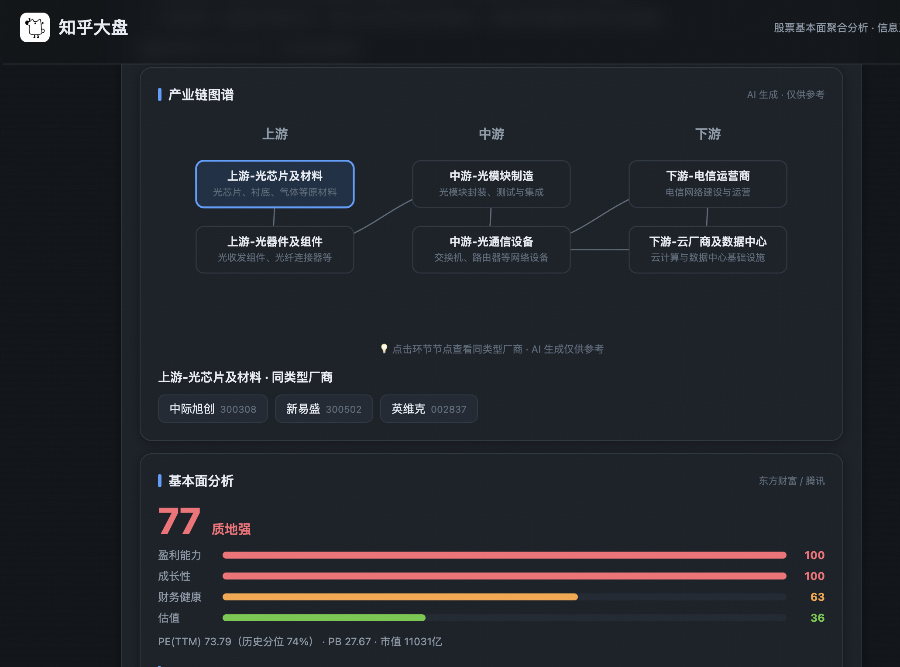
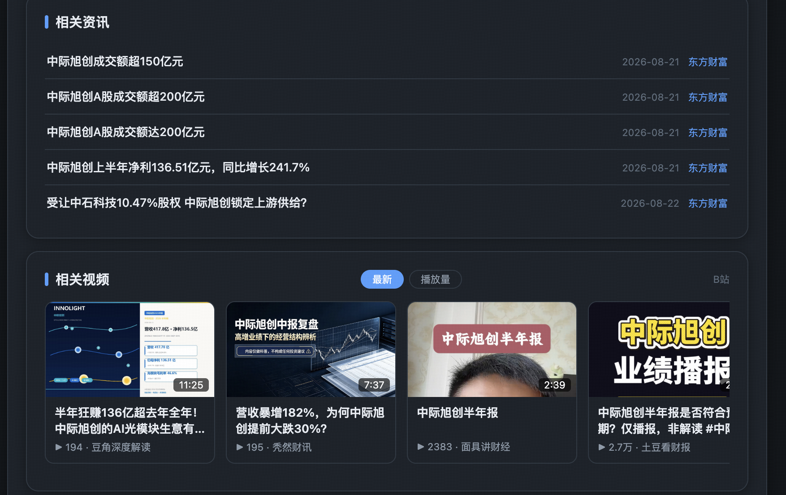

# 知乎大盘 · 股票基本面聚合分析

> 自用数据聚合平台：聚合行情、财报、估值多源数据，用四维评分模型 + AI 解读一只股票的基本面质地。**信息工具，不构成投资建议。**

<div align="center">

**行情（日K/分时）· 财报指标 · 估值分位 · 四维基本面评分 · AI 流式解读 · 看山追问**

[GitHub](https://github.com/ZZ2416/zhihuDP) · [联系与反馈](https://github.com/ZZ2416/zhihuDP/issues)

</div>

---

## 功能特性

- 🔍 **股票识别**：输入名称或代码（`茅台` / `600519`）
- 📊 **四维基本面评分**：盈利 / 成长 / 财务健康 / 估值（PE 历史分位），0-100 加权总分 + 定性（质地强/良好/一般/偏弱）
- 🤖 **AI 基本面解读**：五段流式（综合质地 / 盈利能力 / 成长性 / 财务健康 / 估值与风险），只解读质地不荐股
- 📈 **行情**：实时报价 + 日K线（MA5/10/20、成交量）+ 当日分时图（日K/分时切换，价格/均价/昨收线，30s 实时刷新 + 十字光标交互）
- 📑 **财务解析**：东财双源核心指标（最新报告期 + 5 年年报）+ AI 财报解读
- 💹 **估值**：PE(TTM) 历史分位（东财 419 日序列）、PB、市值（腾讯兜底）
- 📰 **相关资讯**：东方财富资讯，点击跳转原文
- 🎬 **相关视频**：B站视频封面卡片（横滑）
- 🦊 **与看山对话**：基于行情/财报/估值/评分上下文多轮追问，只给方法/维度/风险提示
- 🔑 **密钥配置弹窗**：DeepSeek 密钥 RSA 公私钥加密传输 + 密文持久化（默认密钥绝不下发明文）
- ⚡ **SSE 流式输出** · 🌙 **明暗主题** · 🛡️ **合规设计**（不荐股/无概率词/免责声明） · 📝 **友好降级**

## 界面截图（按时间排序）









## 版本变更

| 版本 | 里程碑 | 说明 |
|---|---|---|
| **v3.0** | 基本面分析（定位转型） | 移除知乎情绪分析；四维评分（盈利/成长/财务健康/估值分位）+ AI 基本面解读；估值 PE 历史分位 |
| v2.3 | 分时图 + B站视频 | 分时图交互与 30s 实时刷新、查询中占位；B站视频资讯（wbi 签名）封面卡片横滑、按时间/播放量排序 |
| v2.2 | 财报解析 + 分时图 | 东财双源财务指标（5年年报）+ AI 流式解读；日K/分时切换；看山对话注入财报上下文；东财资讯可跳转原文 |
| v2.0 | 与看山对话 | 二期：多轮追问对话（AI 看山 Agent，按股票隔离会话）、行情快照/知识库/前次分析注入上下文、合规过滤强化 |
| v1.x | 一期核心 | 个股识别 → 行情/K线 → 情绪面板 → AI 分析；热门榜单、讨论文章、密钥弹窗（RSA 加密）、看山主题 |

> 完整逐条变更见 [docs/CHANGELOG.md](docs/CHANGELOG.md)。

## 技术栈

| 层 | 选型 |
|---|---|
| 语言 | Go 1.25 |
| Agent 框架 | [cloudwego/eino](https://github.com/cloudwego/eino) v0.9.14（ADK ChatModelAgent，ReAct 循环） |
| 模型 | DeepSeek `deepseek-chat`（eino-ext 组件 v0.1.7） |
| 数据源 | 东方财富（财务/估值分位/资讯）、腾讯（行情/分时/估值兜底）、B站（视频） |
| Web | Go 标准库 `net/http` + SSE，前端原生 HTML/JS（零构建，go:embed 内嵌） |

## 快速开始

### 1. 获取密钥（2 个）

| 密钥 | 获取地址 |
|---|---|
| DeepSeek API Key | https://platform.deepseek.com → API Keys |

### 2. 配置（配置文件模式，密钥不入库）

```bash
cd zhihuDP
cp config.example.yaml config.yaml   # 填入你的密钥
```

```yaml
deepseek:
  api_key: "sk-你的DeepSeekKey"          # 必填
```

> `config.yaml` 已被 `.gitignore` 排除，不会进入版本库；权限建议 `chmod 600 config.yaml`。

### 3. 启动

```bash
go run ./cmd/server
# 浏览器访问 http://localhost:8080
```

### 4. CLI 快速验证（可选）

```bash
go run ./cmd/server -q 茅台    # 跑一次完整分析并打印事件，不启动 HTTP
```

## API

### POST /api/ask（SSE 流式）

```bash
curl -N -X POST http://localhost:8080/api/ask \
  -H "Content-Type: application/json" \
  -d '{"stock":"茅台"}'
```

事件协议：`stock`（股票识别）→ `fundamental`（四维评分 JSON）→ `delta`×N（AI 基本面解读）→ `done` / `error`

### POST /api/chat（二期 · 看山追问对话，SSE 流式）

```bash
curl -N -X POST http://localhost:8080/api/chat \
  -H "Content-Type: application/json" \
  -d '{"stock":"600519","market":"沪A","message":"估值分位怎么看？"}'
```

- 会话按股票代码隔离（多轮上下文）；`POST /api/chat/reset` 清空会话
- 事件协议同 `/api/ask`（`delta` → `done` / `error`）

### GET /api/resolve?q=（探针）

```bash
curl "http://localhost:8080/api/resolve?q=600519"
# {"code":"600519","name":"贵州茅台","market":"沪A"}
```

### 其他接口

| 接口 | 说明 |
|---|---|
| `GET /api/kline?code=&market=&days=` | 行情：报价 + 日K线 |
| `GET /api/minute?code=&market=` | 当日分时数据（东财主 + 腾讯兜底） |
| `GET /api/finance?code=&market=` | 财务指标（5年年报 + 最新期，东财双源） |
| `GET /api/fundamental?code=&market=` | 基本面四维评分 + 估值（PE分位/PB/市值） |
| `POST /api/finance/analyze` | 财报 AI 解析（SSE 流式，计配额） |
| `GET /api/hot?type=stock\|sector\|sector_fall\|sector_stock` | 热门股票 / 上升板块 / 暴跌板块 / 板块成分股 |
| `GET /api/news?keyword=&count=` | 相关资讯（标题可跳转原文） |
| `GET /api/video?keyword=&count=` | 相关视频（B站，前端按时间/播放量排序） |
| `GET /api/config/pubkey` | 下发 RSA 公钥（密钥弹窗加密用） |
| `POST /api/config/keys` | 提交加密后的用户密钥（RSA-OAEP，私钥仅服务端） |

## 项目结构（标准 cmd/internal + Router/Handler/Service/Data 四层）

```
zhihuDP/
├── cmd/server/            # 入口：配置加载 → 依赖组装 → 启动（含 CLI 模式）
├── internal/
│   ├── server/            # HTTP 层：Router + Handler（依赖 Analyzer/FinanceProvider 等接口）
│   ├── agent/             # controller 层：eino ADK ReAct 编排 + 看山对话 + 财报解析
│   ├── chat/              # service 层（二期）：会话存储（按股票隔离）+ 上下文事实组装
│   ├── finance/           # dao 层：财务指标（东财 datacenter 主 + F10 兜底）
│   ├── minute/            # dao 层：当日分时（东财 trends2 主 + 腾讯兜底）
│   ├── video/             # dao 层：B站视频搜索（wbi 签名）
│   ├── stock/             # dao 层：股票识别（东财 + 腾讯）
│   ├── kline/             # dao 层：行情 K线（腾讯，除权处理）
│   ├── hot/               # dao 层：热门股票 / 板块榜（腾讯，涨幅/跌幅本地排序）
│   ├── news/              # dao 层：相关资讯（东财，可跳转原文）
│   ├── keybox/            # 密钥箱：RSA 公私钥（弹窗密钥加密传输 + 持久密文）
│   ├── compliance/        # 合规禁用词过滤
│   ├── config/            # 配置文件加载（YAML + env 覆盖 + 脱敏）
│   ├── types/             # 共享结构 + 哨兵错误
│   └── web/               # 前端（独立分层：index.html + css/ + js/ 模块）
└── docs/CHANGELOG.md      # 变更记录
```

## 文档链

| 文档 | 内容 |
|---|---|
| [business-design.md](business-design.md) | 业务定位、规则语义、合规红线、8 项验收标准 |
| [product-design.md](product-design.md) | 产品设计稿（线框、交互、文案规范） |
| [tech-design.md](tech-design.md) | 技术设计（架构、时序、依赖锁定、API 协议） |
| [features/v2/SRS.md](features/v2/SRS.md) | 二期需求规格（看山对话，v0.2 定稿） |
| [features/v2/SDD.md](features/v2/SDD.md) | 二期技术设计（会话/快照/人设/合规） |
| [features/finance/设计方案.md](features/finance/设计方案.md) | 财报解析设计方案（东财双源 + AI 解读） |
| [features/finance/SRS.md](features/finance/SRS.md) | 财报解析需求规格 |
| [features/finance/SDD.md](features/finance/SDD.md) | 财报解析技术设计 |
| [features/minute/SRS.md](features/minute/SRS.md) | 分时图需求规格 |
| [features/fundamental/设计方案.md](features/fundamental/设计方案.md) | 基本面分析设计方案（四维评分/估值分位） |
| [features/fundamental/SDD.md](features/fundamental/SDD.md) | 基本面分析技术设计（v0.4 含实现差异） |
| [features/minute/SDD.md](features/minute/SDD.md) | 分时图技术设计 |
| [features/video/SRS.md](features/video/SRS.md) | B站相关视频需求规格 |
| [features/video/SDD.md](features/video/SDD.md) | B站相关视频技术设计 |
| [docs/CHANGELOG.md](docs/CHANGELOG.md) | 变更记录 |

## 路线图

- [x] **阶段 1**：个股识别 → 行情/财报/AI 分析（数据底座）
- [x] **阶段 2**：看山对话、密钥安全、分时图、媒体播放
- [x] **阶段 3（当前）**：基本面定位转型——四维评分 + 估值分位 + AI 解读
- [ ] 阶段 4：产业链聚合分析、评分历史对比、批量数据导出

## 免责声明

> 本工具仅聚合展示东方财富、腾讯等公开行情与财务信息，并进行基本面质地评分与解读，不构成任何投资建议，不构成对任何证券的买入、卖出或持有建议。据此操作，风险自担。评分反映财务状况的充分程度，不代表涨跌预测。

## 许可证

暂未指定（个人项目）。
