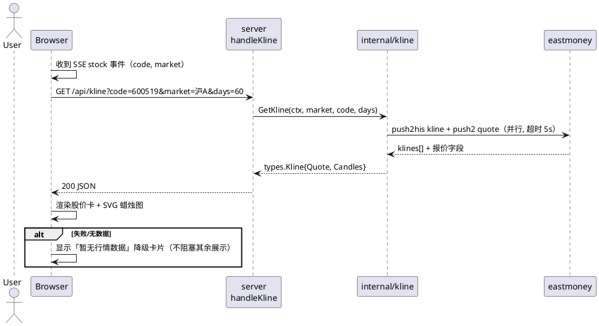

# K线图与股价信息功能 — 软件设计文档（SDD）

> 版本：v0.1
> 日期：2026-08-16
> 状态：待评审
> 分支：`feature/kline`
> 依据：`features/kline/SRS.md`（需求规格）
> 原则：**行情数据为展示数据，不进 LLM 上下文**（合规红线，SRS FR6）

---

## 1. 概述

在现有「情绪面板 + AI 分析」基础上，为搜索结果页新增**股价信息卡 + 日K线蜡烛图**。行情通过独立 REST 接口由前端拉取，与 SSE 分析流并行，互不阻塞；新增 dao 层包 `internal/kline`，与情绪链路完全解耦。

## 2. 总体设计

### 2.1 分层归属

```
internal/server（HTTP 层）
  ├─ handler_kline.go   GET /api/kline（新增）
  └─ KlineProvider 接口（消费方定义）
        ↑ 实现
internal/kline（dao 层，新增）—— 腾讯 K线 + 实时报价客户端（单请求）
internal/types（共享）—— Candle / Quote / Kline 结构
internal/web/index.html（前端）—— 股价卡 + SVG 蜡烛图渲染
```

### 2.2 数据流

```
用户搜索 → POST /api/ask（SSE）→ 前端收到 stock 事件（code/market）
              │
              ├─（异步，并行）GET /api/kline?code=&market=&days=
              │     → internal/kline.GetKline → 腾讯接口（单请求） → JSON
              │     → 前端渲染股价卡 + 蜡烛图（失败则降级卡片）
              └─（继续消费 SSE）sentiment / delta → 情绪面板 + AI 分析
```

### 2.3 合规隔离

- `internal/agent`、`internal/sentiment` **不 import** `internal/kline`；
- 工具列表不新增行情工具；LLM 上下文中无任何价格字段（代码评审检查项）。

## 3. 数据结构（internal/types 新增）

```go
// Candle 单根日K
type Candle struct {
    Date   string  `json:"date"`   // 2026-08-12
    Open   float64 `json:"open"`
    Close  float64 `json:"close"`
    High   float64 `json:"high"`
    Low    float64 `json:"low"`
    Volume float64 `json:"volume"` // 手
}

// Quote 实时报价
type Quote struct {
    Code      string  `json:"code"`
    Name      string  `json:"name"`
    Price     float64 `json:"price"`      // 最新价
    Change    float64 `json:"change"`     // 涨跌额
    ChangePct float64 `json:"change_pct"` // 涨跌幅 %
    Open      float64 `json:"open"`
    High      float64 `json:"high"`
    Low       float64 `json:"low"`
    Volume    float64 `json:"volume"`     // 手
    PrevClose float64 `json:"prev_close"`
}

// Kline 行情响应（/api/kline 返回体）
type Kline struct {
    Quote   Quote    `json:"quote"`
    Candles []Candle `json:"candles"` // 升序（旧→新），空数组表示无数据
}
```

## 4. API 设计

### GET /api/kline

| 参数 | 类型 | 必填 | 说明 | 边界 |
|---|---|---|---|---|
| code | string | 是 | 股票代码 | 空 → 400 |
| market | string | 否 | 沪A/深A/北A（也接受 sh/sz/bj） | 默认沪A；非法 → 400 |
| days | int | 否 | K线根数 | clamp [10,250]，默认 60 |

**响应 200**：
```json
{ "quote": { "code":"600519","name":"贵州茅台","price":1341.99,"change":-13.30,
             "change_pct":-0.98,"open":1355.00,"high":1359.00,"low":1338.14,
             "volume":29853,"prev_close":1355.29 },
  "candles": [ {"date":"2026-08-12","open":1346.50,"close":1343.00,"high":1356.88,"low":1332.51,"volume":35060}, ... ] }
```

**错误**：400（参数非法）/ 404（无数据，可返回空 candles 代替）/ 502（腾讯失败，透传摘要）。

## 5. 时序图



## 6. 模块与方法说明

### internal/kline/kline.go（dao 层，新增）

**`func GetKline(ctx context.Context, market, code string, days int) (*types.Kline, error)`**
- 类型：包级函数；调用方：`internal/server`（经 KlineProvider 接口）
- 职责：请求腾讯接口一次，同时返回 K线 + 实时报价，组装 `types.Kline`
- 入参：`market`（沪A/深A/北A/sh/sz/bj）、`code`、`days`
- 边界：
  - secid 映射：沪A→1、深A→0、北A→0；market 非法 → 错误
  - days clamp [10,250]
  - 腾讯非 200 / JSON 解析失败 → 明确错误；除权除息行的分红对象需宽容解析（RawMessage 取前 6 字段）
  - `klines` 为空 → 返回空 `Candles`（非 nil，前端走降级）
- 关键约束：单请求超时 5s；带浏览器 UA（Go 默认 UA 曾被拒）；报价取 qt 数组固定索引（[3]最新价 [4]昨收 [31]涨跌 [32]涨跌% [33]最高 [34]最低）

**`func secidOf(market string) (string, error)`**：市场 → secid 前缀（内部函数）

### internal/server（HTTP 层）

**`type KlineProvider interface { GetKline(ctx context.Context, market, code string, days int) (*types.Kline, error) }`**
- 消费方定义接口；`cmd/server` 用适配器 `klineProviderFunc` 注入

**`func (s *Server) handleKline(w, r)`**
- 解析参数（code 必填、market 归一化、days clamp）
- 调 `s.klineProvider.GetKline` → 200 JSON；错误映射 400/502

**`server.New(analyzer, resolver, klineProvider, indexHTML)`**：签名扩展（新增 klineProvider 参数）

### cmd/server/main.go

- `klineProvider := klineProviderFunc(kline.GetKline)` + 编译期断言
- `server.New(deps, stock.Resolve, klineProvider, indexHTML)`

### internal/web/index.html（前端）

**`async function fetchKline(code, market)`**：收到 `stock` 事件后调用，返回 JSON；失败静默（降级卡片）
**`function renderQuote(q)`**：股价卡（最新价大字号 + 涨跌幅红涨绿跌 + 今开/最高/最低/昨收/成交量网格）
**`function renderKline(candles)`**：SVG 蜡烛图（见 §7）

## 7. 前端设计（SVG 蜡烛图渲染规则）

- 容器：`viewBox` 自适应（宽 100%，高 260px 蜡烛区 + 60px 成交量区 + 20px 日期轴）
- 蜡烛：`wick`（最高↔最低竖线）+ `body`（开收矩形，实体最小 1px）
  - 配色：收≥开 → 红 `#f5222d`（涨）；收<开 → 绿 `#389e0d`（跌）——与情绪面板 bull/bear 一致
  - 主题：网格线/日期文字用 `var(--border)` / `var(--faint)`（自动适配明暗）
- 成交量柱：按 max(volume) 等比缩放，颜色与蜡烛一致（半透明）
- 坐标轴：Y 轴取 [min(low), max(high)] 留 5% 边距，4-5 个价格刻度（`toFixed(2)`）；X 轴显示首/中/末日期
- 缩放：candleWidth = plotW / n，实心宽 = candleWidth * 0.6
- 空数据：显示「暂无行情数据」降级卡片

## 8. 边界处理

| 场景 | 处理 |
|---|---|
| 停牌/新股 | 腾讯 klines 为空 → 空数组 → 前端降级卡片 |
| 北交所 | market=北A → secid `0` 前缀（需实测验证） |
| days 越界 | clamp [10,250] |
| 腾讯超时/失败 | 502 + 前端降级卡片（不影响情绪/AI） |
| 并发 | K线请求与 SSE 并行（前端异步），服务端无共享状态 |

## 9. 上线三板斧（demo 版）

### 监控
- 结构化日志：`[kline] code=600519 market=沪A days=60 耗时=XXXms candles=60`
- 失败计数：腾讯错误摘要

### 灰度
- 无用户体系；前端渐进增强（K线失败降级卡片），天然可回退

### 回滚
- 无状态无 DB；接口与前端均独立，可单独回退
- 数据源单点：腾讯失败自动降级；如需切换可改 `internal/kline`（单点）

## 10. 待确认问题

- [ ] 默认 60 根、均线叠加、红涨绿跌配色（同 SRS §8，实现前确认）
- [ ] 北交所 secid `0` 前缀实测（如无北交所测试标的，标注降级支持）
- [ ] `server.New` 签名扩展（3→4 参数）是否接受（或改为 `server.Config` 结构体）
