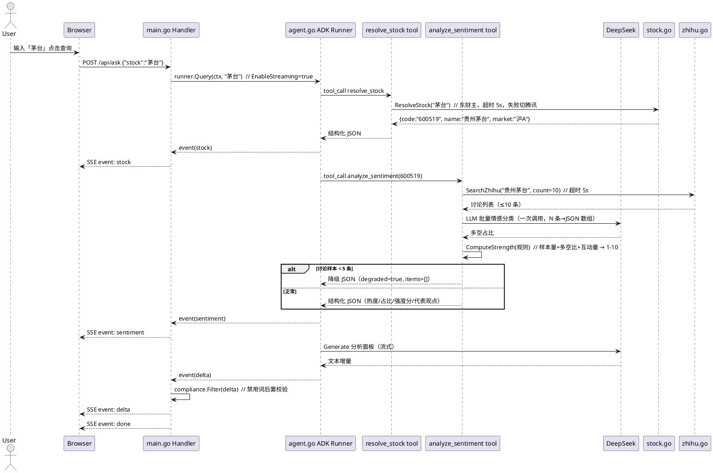
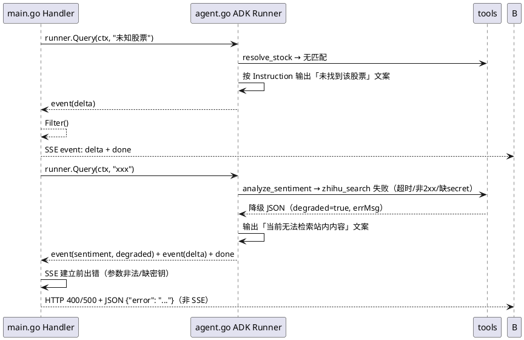

# 知乎股票情绪分析工具 — 技术设计

> 版本：v1.3
> 日期：2026-08-16
> 状态：初稿待评审
> 关联文档：`business-design.md`（业务设计文档 v1.0，规则与验收准绳）；`product-design.md`（产品设计稿 v0.1）
> 变更：v1.1 解耦旧 design.md（已废弃，不再引用）；v1.2 目录结构升级为标准 cmd/internal 布局（依赖注入、go:embed 前端）；v1.3 增加 Router/Handler/Service/Data 四层（internal/server + Analyzer/Resolver 接口 + 哨兵错误）

---

## 1. 需求概述

把「知乎股票情绪分析工具」产品稿（v0.1）落地为 Go demo：

- 用户输入股票名称/代码 → 详情页展示**结构化情绪面板**（讨论热度 / 多空占比 / 代表观点 / 参考强度分 1-10）+ **AI 分析面板**（流式文案：情绪面总结 / 关注点 / 风险提示）。
- 技术链路：eino ADK `ChatModelAgent`（ReAct）+ DeepSeek + 两个自定义工具（`utils.InferTool` 泛型版），SSE 流式输出，合规禁用词后置过滤。
- **范围**：单只股票、A股优先、按需实时生成（无定时任务）；**行情面不做**（已确认：知乎接口含部分行情数据，阶段 2 复用，见 business-design.md §9）；无数据库、无状态。

核心验证目标（沿用立项初衷）：eino 接入 DeepSeek + 自定义工具完整链路；知乎 `zhihu_search` 接口可用性；第三方股票识别接口可用性（东财 suggest 已实测）。

业务验收准绳：business-design.md §6 共 8 项（链路/接口/覆盖率≥60%/降级/合规 0 命中/演示/情感分类轻量基准），技术实现须满足 #1-#6、#8，本设计逐项映射到 §3 方法与 §6 实现拆分。

## 2. 总体架构与时序图

```
前端 internal/web/index.html（首页搜索 + 详情页，原生 HTML/JS，go:embed 内嵌）
  ↓ POST /api/ask {"stock":"..."} → SSE 事件流
main.go —— HTTP 路由、SSE 写入、事件解析、合规过滤
  ↓ runner.Query（流式）
agent.go —— eino ADK ChatModelAgent（ReAct 循环）
  Tools：
   ├─ resolve_stock      股票识别（东财 suggest 主 + 腾讯 smartbox 兜底）
   └─ analyze_sentiment  情绪分析（内部：zhihu_search → LLM 批量分类 → 规则强度分）
  ↓
stock.go / zhihu.go / sentiment.go / compliance.go（独立模块）
```

### 2.1 项目架构定义（M0 落地依据）

**① 项目目录结构（标准 cmd/internal 布局 + Router/Handler/Service/Data 四层，v1.3 分层）**

```
zhihuDP/
├── cmd/
│   └── server/
│       └── main.go              # 入口（薄）：config.Load → buildDeps → server.New → 启动；CLI 模式(-q)
├── internal/
│   ├── server/                  # HTTP 层：Router + Handler（依赖 Analyzer/Resolver 接口）
│   │   ├── server.go            # 接口定义 + Server{analyzer, resolver, indexHTML} + New + Routes
│   │   ├── handler_ask.go       # POST /api/ask（SSE 流式）
│   │   ├── handler_resolve.go   # GET /api/resolve（探针）
│   │   ├── handler_index.go     # GET /（go:embed 前端）
│   │   ├── response.go          # writeJSON / writeSSE
│   │   └── server_test.go       # httptest（mock 接口实现）
│   ├── agent/                   # Service：ReAct 编排（Deps 注入 + RunAnalysis）
│   ├── sentiment/               # Service：情绪分析（Analyze）
│   ├── zhihu/                   # Data：知乎搜索客户端（Client.Search）
│   ├── stock/                   # Data：股票识别（Resolve）
│   ├── compliance/              # 合规过滤（Filter / FilterFinal）
│   ├── config/                  # 配置加载（Load）
│   ├── types/                   # 共享结构 + 哨兵错误（ErrStockNotFound 等）
│   └── web/                     # 前端资源（go:embed index.html）
├── docs/
│   └── CHANGELOG.md
├── config.example.yaml
├── .gitignore
└── go.mod / go.sum
```

**分层调用关系**：

```
Router(server.Routes) → Handler(server.handle*) → Service 接口(Analyzer/Resolver)
                                                    ├─ agent.RunAnalysis（编排）
                                                    │    └─ sentiment.Analyze → zhihu.Client（Data）
                                                    └─ stock.Resolve（Data）
```

**② 模块依赖（import 方向，单向无环；依赖注入避免全局状态）**

```
internal/types       ◄── 全部业务包（含哨兵错误，handler 不反向依赖 data 层）
internal/config      ◄── cmd/server / sentiment / agent / zhihu
internal/stock       ◄── cmd/server（适配为 Resolver 接口）
internal/zhihu       ◄── cmd/server（组装）/ sentiment.Analyze 入参
internal/sentiment   ◄── cmd/server（buildDeps 注入）
internal/compliance  ◄── internal/agent（delta 过滤）
internal/agent       ◄── cmd/server（适配为 Analyzer 接口）
internal/web         ◄── cmd/server（go:embed 读取）
internal/server      ◄── cmd/server（New 注入接口实装）
```

**③ 并发模型**：单进程；每个 `/api/ask` 一个 goroutine，各自创建独立 agent/runner 实例（无共享可变状态，天然并发安全）；各包**无全局变量**（依赖经 `buildDeps` 显式注入）；无 DB/缓存/队列。

**④ 配置流向**：`cmd/server` 调 `config.Load("config.yaml")` → `buildDeps(cfg)` 组装 `zhihu.Client` + `sentiment.Analyze` 闭包 + `agent.Deps` → 各包经入参取所需配置。

**⑤ 前端结构**：单文件 `index.html` 双视图（搜索页 `#/` + 详情页），`fetch` + `ReadableStream` 解析 SSE；经 `//go:embed` 内嵌，无构建、不依赖运行目录。

**⑥ 运行形态与使用流程（本地单机部署）**：一台电脑即可使用。用户三步：① 复制 `config.example.yaml` 为 `config.yaml` 并填入自己的密钥；② `go run ./cmd/server`（或编译后运行）启动；③ 浏览器访问 `http://localhost:8080`。无外部服务、无部署步骤、密钥只在本机配置文件里。

### 2.2 主流程时序（含降级分支）



### 2.3 异常分支时序



## 3. 接口/方法说明

### 3.1 模块划分与依赖

| 包/文件 | 职责 | 依赖 |
|---|---|---|
| `cmd/server/main.go` | 入口：配置加载、`buildDeps` 组装、注入 `server.New`、启动、CLI 模式 | 全部 internal 包 |
| `internal/server` | HTTP 层：Router（Routes）+ Handler（SSE/探针/前端）+ `Analyzer`/`Resolver` 接口 | agent/stock 接口、types、web |
| `internal/config` | 配置加载（YAML + env 覆盖 + 默认值 + 脱敏） | gopkg.in/yaml.v3 |
| `internal/types` | 共享数据结构 + 哨兵错误（`ErrStockNotFound`/`ErrEmptyQuery`） | 无 |
| `internal/stock` | 股票识别（东财主 + 腾讯兜底） | net/http，零第三方 |
| `internal/zhihu` | 知乎搜索客户端（`Client.Search`，Bearer 鉴权） | net/http + json |
| `internal/sentiment` | 情绪分析编排：搜索→LLM 分类→规则强度分 | zhihu、eino-ext/deepseek |
| `internal/agent` | ADK agent 组装 + 事件分发（`Deps` 注入） | eino/adk、eino-ext/deepseek、compliance |
| `internal/compliance` | 禁用词过滤 | 无 |
| `internal/web` | 前端资源（go:embed） | 无 |

### 3.2 内部方法

#### internal/config

**`func Load(path string) (*Config, error)`**
- 类型：内部方法；所属模块：`config.go`；调用方：`main()`
- 职责：加载配置文件（**配置文件模式**，用户复制模板后自定义密钥）
- 结构：
  ```go
  type Config struct {
      Zhihu struct {
          AccessSecret   string `yaml:"access_secret"`    // 必填：知乎 Bearer token
          OpenAPIBaseURL string `yaml:"openapi_base_url"` // 默认 https://developer.zhihu.com
          SearchURL      string `yaml:"zhihu_search_url"` // 可选：完整 endpoint，优先级最高
      } `yaml:"zhihu"`
      DeepSeek struct {
          APIKey  string        `yaml:"api_key"`  // 必填
          BaseURL string        `yaml:"base_url"` // 默认 https://api.deepseek.com
          Timeout time.Duration `yaml:"timeout"`  // 默认 120s
      } `yaml:"deepseek"`
      Server struct {
          Port int `yaml:"port"` // 默认 8080
      } `yaml:"server"`
  }
  ```
- 加载优先级：环境变量 > `config.yaml` > 默认值（env 便于 CI/部署注入，不设则忽略）
- 边界/null：文件不存在 → 用默认值 + 警告；YAML 解析失败 → 报错退出；必填密钥（`AccessSecret`/`APIKey`）缺失 → 启动时警告、调用时明确报错（**不 panic**）；`Config.String()` 脱敏，任何日志不打印 secret

#### internal/stock

**`func Resolve(ctx context.Context, query string) (*StockInfo, error)`**
- 类型：内部方法；所属模块：`internal/stock`；调用方：`cmd/server`（探针）、agent `Deps.ResolveStock`
- 职责：股票名称/代码 → 结构化股票信息；东财 suggest 主选，失败/无匹配自动切腾讯 smartbox
- 入参：`query` 股票名称或代码（如「茅台」「600519」）
- 出参：`*StockInfo{Code, Name, Market string}`；无匹配时返回 `ErrStockNotFound`
- 边界/null：`query` 为空 → 返回 `ErrEmptyQuery`（调用方转 400）；两个源都无匹配 → `ErrStockNotFound`；两源都失败 → 透传最后一个错误
- 关键约束：单次请求超时 5s（`http.Client{Timeout: 5s}`）；对东财返回做白名单校验（`Classify=="AStock"` 优先，避免匹配到基金/债券）

**`func resolveViaEastmoney(ctx, query) (*StockInfo, error)` / `resolveViaTencent(ctx, query) (*StockInfo, error)`**
- 内部实现函数，封装各自接口与解析；东财：`GET https://searchapi.eastmoney.com/api/suggest/get?input={q}&type=14&count=5`；腾讯：`GET https://smartbox.gtimg.cn/s3/?v=2&q={q}&t=all`（两接口均已实测可用）

#### internal/zhihu

**`func (c *Client) Search(ctx context.Context, query string, count int) (*SearchResponse, error)`**
- 类型：内部方法；所属模块：`internal/zhihu`（`New(cfg) *Client` 构造）；调用方：`internal/sentiment`
- 职责：调用知乎 `zhihu_search` 开放接口
- 入参：`query` 搜索词；`count` 返回条数，clamp 1–10（默认 10）
- 出参：`*SearchResponse`（契约如下，字段名以知乎接口实际返回为准，落地时实测微调）：
  ```go
  type SearchResponse struct {
      Code    int    `json:"Code"`    // 0 为成功；非 0 透传 Message
      Message string `json:"Message"`
      Data    struct {
          HasMore bool   `json:"HasMore"`
          Items   []Item `json:"Items"`
      } `json:"Data"`
  }
  type Item struct {
      Title       string `json:"Title"`
      Url         string `json:"Url"`
      ContentText string `json:"ContentText"`
      AuthorName  string `json:"AuthorName"`
      VoteUpCount int    `json:"VoteUpCount"`
      EditTime    int64  `json:"EditTime"`
  }
  ```
- 边界/null：缺 `cfg.Zhihu.AccessSecret` → 明确报错（不 panic）；非 2xx → 透传响应体；非 JSON → 解析错误；`Data.Items` 为空 → 返回空 `Items`（非 nil）
- 关键约束：端点解析优先级 `cfg.Zhihu.SearchURL`（非空时）> `cfg.Zhihu.OpenAPIBaseURL + /api/v1/content/zhihu_search` > 默认 `https://developer.zhihu.com`；请求头 `Authorization: Bearer {secret}` + `X-Request-Timestamp: {unix秒}` + **`Content-Type: application/json`**（官方文档确认）；参数名 `Query`（`--data-urlencode` 语义，GET）；超时 5s；**任何日志不打印 secret**

#### internal/sentiment

**`func Analyze(ctx context.Context, code, name string, zh *zhihu.Client, ds config.DeepSeekConfig) (*SentimentResult, error)`**
- 类型：内部方法；所属模块：`internal/sentiment`；调用方：`cmd/server`（`buildDeps` 注入为 agent `Deps.AnalyzeSentiment`）
- 职责：编排「知乎搜索 → LLM 批量情感分类 → 规则强度分」，产出情绪面板结构化数据
- 入参：`code` 股票代码（必填）、`name` 股票名称
- 出参：`*SentimentResult`：
  ```go
  type SentimentResult struct {
      Code     string     `json:"code"`
      Name     string     `json:"name"`
      Heat     int        `json:"heat"`      // 近 30 天讨论量
      Sample   int        `json:"sample"`    // 实际分类样本数
      Ratio    Ratio      `json:"ratio"`     // Bull/Bear/Neutral float64（占比 0-1）
      Score    *int       `json:"score"`     // 参考强度 1-10；样本不足时为 nil
      Items    []ViewItem `json:"items"`     // 代表观点（≤5 条）
      Degraded bool       `json:"degraded"`  // true = 降级（样本不足或搜索失败）
      ErrMsg   string     `json:"err_msg,omitempty"`
  }
  type ViewItem struct {
      Title    string `json:"title"`
      Url      string `json:"url"`
      Author   string `json:"author"`
      VoteUp   int    `json:"vote_up"`
      Excerpt  string `json:"excerpt"`
      Sentiment string `json:"sentiment"` // bull/bear/neutral
  }
  ```
- 边界/null：讨论样本 < 5 → `Degraded=true, Score=nil, Items=[]`（前端隐藏强度分，展示「暂无情绪数据」空态）；搜索失败 → `Degraded=true, ErrMsg` 填充，仍返回 `nil error`（让 agent 走降级文案而不是中断）
- 关键约束：整体超时 15s（搜索 5s + 分类 10s 预留）

**`func classifyPosts(ctx context.Context, posts []Post) (Ratio, error)`**
- 类型：内部方法；职责：LLM 批量情感分类（一次调用分类 N 条）
- 实现：直接调 `eino-ext/components/model/deepseek` 的 `Generate`（非 agent 循环）；prompt 契约：输入「股票名 + N 条讨论（id+标题+摘要+互动量）」，输出 JSON 数组 `[{id, sentiment: bull|bear|neutral}]`；JSON 解析失败 → 重试 1 次 → 仍失败返回错误（由 AnalyzeSentiment 降级）
- 边界：空输入 → 直接返回空占比；单条超长 → 截断至 200 字

**`func ComputeStrength(r Ratio, sample, heat int) int`**
- 类型：纯函数；职责：规则计算参考强度 1-10（**非概率**，可解释可复现）
- 规则（已实现定稿，2026-08-16）：`score = clamp( round( 1 + 6*max(bull,bear) + log10(1+sample)/2 + min(heat,50)/100 ), 1, 10 )`（多空一致性主导：五五开≈4-5 分、强一致≈7-9 分；样本/热度仅小幅修正，避免「样本多但分歧大」虚高；配套单测 `TestComputeStrength`）
- 边界：`sample<5` → 调用方不调用此函数（Score=nil）

#### internal/compliance

**`func Filter(text string) string`**
- 类型：内部方法；职责：对 AI 输出做禁用词后置校验（产品稿 §8 措辞表）
- 规则：命中禁用词（买入/卖出/持有/建议/概率/预测/推荐 等，含常见变体如「可以上车」「减仓」）→ 剔除整句（按句号分句后过滤）；过滤后为空 → 返回兜底文案「当前分析暂不可用，请查看情绪面板数据」
- 边界：空文本 → 原样返回；大小写/中英文混合 → 统一小写后匹配

#### internal/agent

**`func RunAnalysis(ctx context.Context, stockQuery string, deps Deps, sink func(Event) error) error`**
- 类型：内部方法；所属模块：`internal/agent`；调用方：`cmd/server`（HTTP 与 CLI 模式）
- 依赖注入：`Deps{ResolveStock, AnalyzeSentiment funcs, DeepSeek config.DeepSeekConfig}` 由 `cmd/server.buildDeps` 组装；工具闭包直接捕获 `sink`（结构化事件 `stock`/`sentiment` 在工具内直发，无需 context 传递）
- 组装（已按 eino v0.9.14 源码核对）：
  ```go
  resolveTool, err := utils.InferTool("resolve_stock",
      "将股票名称或代码解析为股票信息（代码、名称、市场）。",
      func(ctx context.Context, req *struct {
          Query string `json:"query" jsonschema_description:"股票名称或代码，如 茅台 / 600519"`
      }) (string, error) {
          info, err := ResolveStock(ctx, req.Query)
          if err != nil { return "", err }
          b, _ := json.Marshal(info)
          return string(b), nil
      })
  // analyze_sentiment 同理：入参 {code, name} → 返回 SentimentResult 的 JSON 字符串

  cm, err := deepseek.NewChatModel(ctx, &deepseek.ChatModelConfig{
      APIKey:  cfg.DeepSeek.APIKey,
      Model:   "deepseek-chat",
      BaseURL: cfg.DeepSeek.BaseURL, // 默认 https://api.deepseek.com
      Timeout: cfg.DeepSeek.Timeout, // 默认 120s；分类调用（classifyPosts）复用 cm 并以 ctx 超时 60s 控制
  })

  agent, err := adk.NewChatModelAgent(ctx, &adk.ChatModelAgentConfig{
      Name: "zhihu-stock-sentiment-agent",
      Instruction: "你是知乎股票情绪分析助手。流程固定：1) 必须先调用 resolve_stock 识别股票；" +
          "2) 再调用 analyze_sentiment 获取情绪数据；3) 基于返回的 JSON 撰写分析面板，分三段：情绪面总结、值得关注的讨论点、风险提示。" +
          "若 degraded=true 则说明数据不足。严格约束：不得出现买入/卖出/持有/建议/概率/预测等投资建议措辞；不得编造返回 JSON 中不存在的观点。",
      Model: cm,
      ToolsConfig: adk.ToolsConfig{
          ToolsNodeConfig: compose.ToolsNodeConfig{
              Tools: []tool.BaseTool{resolveTool, sentimentTool}, // InvokableTool 内嵌 BaseTool，可直接放入
          },
      },
      MaxIterations: 5,
  })
  ```
- 边界：任一工具构建失败 → 返回错误，启动时 fail-fast（缺密钥只警告，调用时再报错）

**`func RunAnalysis(ctx context.Context, stockQuery string, deps Deps, sink func(Event) error) error`**
- 类型：内部方法；所属模块：`internal/agent`；职责：运行 agent 并分发事件
- 入参：`stockQuery` 用户输入；`deps` 依赖注入；`sink` 回调 `func(Event) error`
- 实现：`runner := adk.NewRunner(ctx, adk.RunnerConfig{Agent: agent, EnableStreaming: true})`；`iter := runner.Query(ctx, stockQuery)`；`for ev, ok := iter.Next(); ok; ev, ok = iter.Next()` 遍历 `*adk.AgentEvent`：
  - `ev.Err != nil` → 产出 `error` 事件
  - `ev.Output.MessageOutput.Role == schema.Tool` → 解析工具名：`resolve_stock` → `stock` 事件；`analyze_sentiment` → `sentiment` 事件
  - `Role == schema.Assistant` 且 `IsStreaming` → `defer mv.MessageStream.Close()`；`for { chunk, err := mv.MessageStream.Recv(); errors.Is(err, io.EOF) → break; err != nil → error 事件; else chunk.Content 为增量文本 → delta 事件 }`；非流式则整条 `delta`（已按 v0.9.14 源码核实：无 PartialOutput helper，直接用 Recv 循环）
- 边界：ctx 取消（客户端断开）→ 立即返回；工具事件 JSON 解析失败 → 跳过该事件并记日志，不中断流

#### cmd/server

**`func handleAsk(w http.ResponseWriter, r *http.Request)`**
- 类型：HTTP 接口；路径：`POST /api/ask`
- 职责：解析入参 → 建立 SSE → 调 `runAnalysis` → 事件转发
- 入参：body `{"stock":"..."}`；`stock` 为空 → 直接 400 JSON（SSE 建立前错误不走 SSE）
- 关键约束：SSE 响应头 `Content-Type: text/event-stream`、`Cache-Control: no-cache`、`X-Accel-Buffering: no`；`http.Flusher` 断言失败 → 500；`r.Context()` 传入 `agent.RunAnalysis`（断连即取消，防 goroutine 泄漏/白烧 token）

**`func handleResolve(w http.ResponseWriter, r *http.Request)`**
- 类型：HTTP 接口；路径：`GET /api/resolve?q=茅台`
- 职责：M0 探针，脱离 LLM 直连 `ResolveStock` 验证第三方接口连通性
- 出参：`{"code":"600519","name":"贵州茅台","market":"沪A"}`；无匹配 → 404 JSON

**`func writeSSE(w http.ResponseWriter, event string, data any)`**
- 类型：内部方法；职责：按 SSE 协议写 `event:`/`data:` 行 + 空行 + `Flush()`

## 4. API / RPC 文档

### HTTP 接口：POST /api/ask（SSE 流式）

- 请求体：
  | 字段 | 类型 | 必填 | 说明 | 边界/null 处理 |
  | --- | --- | --- | --- | --- |
  | stock | string | 是 | 股票名称或代码 | 空/缺失 → 400 `{"error":"stock is required"}`；非 JSON body → 400 |
- SSE 事件协议：
  | event | data | 含义 |
  | --- | --- | --- |
  | `stock` | `{code,name,market}` | 股票识别结果（前端详情页头部） |
  | `sentiment` | `SentimentResult` JSON | 情绪面板结构化数据（含 degraded 降级标记） |
  | `delta` | `{text}` | 分析面板文本增量（已过合规过滤） |
  | `done` | `{}` | 结束 |
  | `error` | `{message}` | 运行期错误（SSE 建立后只能靠它收尾） |
- 响应：200 + `text/event-stream`；SSE 建立前校验失败 → 400/500 + JSON

### HTTP 接口：GET /api/resolve?q=

- 请求：`q` 必填；响应 `{"code","name","market"}`；无匹配 404；下游失败 502 + 透传原因

### HTTP 接口：GET /

- 托管 `internal/web/index.html`（go:embed 内嵌）

## 5. 数据/缓存/配置变更

- **无数据库、无持久化**；demo 按需实时生成，无日频快照（定时任务列为阶段 2 非目标）
- **配置（配置文件模式）**：密钥与参数集中在 `config.yaml`，用户复制 `config.example.yaml`（入库模板）后填入自定义密钥；`config.yaml` 进 `.gitignore`；实现见 §3.2 config.go
- 模板（`config.example.yaml`）：
  ```yaml
  zhihu:
    access_secret: ""                    # 必填：知乎 Bearer token
    openapi_base_url: "https://developer.zhihu.com"
    zhihu_search_url: ""                 # 可选：完整 endpoint，优先级最高
  deepseek:
    api_key: ""                          # 必填：DeepSeek 密钥
    base_url: "https://api.deepseek.com"
    timeout: 120s
  server:
    port: 8080
  ```
- 加载优先级：环境变量 > `config.yaml` > 默认值

- 依赖锁定（已实测解析并核对 API，2026-08-16）：

| 模块 | 版本 | 核对结论 |
| --- | --- | --- |
| `github.com/cloudwego/eino` | **v0.9.14**（最新稳定版） | ✅ 五个关键 API 全部通过：`adk.NewChatModelAgent`（chatmodel.go:503）、`TypedRunner.Query → AsyncIterator`（runner.go:108）、`adk.ToolsConfig` 内嵌 `compose.ToolsNodeConfig`（chatmodel.go:136）、泛型 `utils.InferTool[T,D]`（invokable_func.go:46）、`tool.InvokableTool` 内嵌 `BaseTool` |
| `github.com/cloudwego/eino-ext/components/model/deepseek` | **v0.1.7**（独立子模块） | ✅ `NewChatModel`（deepseek.go:140）；`ChatModelConfig{APIKey, Model, BaseURL, Timeout, HTTPClient}`（deepseek.go:56）；其 go.mod 要求 eino v0.7.13，MVS 取 v0.9.14 兼容 |
| `gopkg.in/yaml.v3` | **v3.0.1** | 配置文件解析（config.yaml） |

## 6. 实现拆分

1. **M0 骨架 + 数据客户端**：`go mod init`、`zhihu.go`、`stock.go`、`GET /api/resolve` 探针。验证：`curl "localhost:8080/api/resolve?q=茅台"` 返回东财结果
2. **M1 情绪分析 + Agent**：`sentiment.go`（分类+强度分）、`agent.go`（2 工具）、命令行跑通「识别→情绪→分析文案」。验证：`go run . 茅台` 打印 SentimentResult + 三段文案；**5 只热门股各抽 10 条分类结果人工核对，明显错误 ≤2 条（业务验收 #8）**
3. **M2 Web 层**：`cmd/server` SSE、`internal/compliance`、`internal/web/index.html` 两页（搜索页 + 详情页，`fetch`+`ReadableStream` 手写 SSE 解析）。验证：浏览器端到端流式展示
4. **M3 打磨**：`config.example.yaml` 模板、README、免责声明、错误收口、日志脱敏

## 7. 上线三板斧（demo 版）

### 监控
- 结构化请求日志：请求 ID、股票、`resolve/sentiment/delta` 各阶段耗时、样本数、`Degraded` 标记、知乎返回 `Code`、错误摘要
- 关键路径埋点：工具调用（名称、入参、耗时）、SSE 事件计数
- **日志脱敏：任何日志不打印 secret**

### 灰度
- 无用户体系，不做按比例灰度；以 `GET /api/resolve` 探针作为第三方接口连通性哨兵（定时 curl 检查）
- 数据源可配置切换：东财/腾讯双实现，失败自动降级（天然容灾）

### 回滚
- 无状态、无 DB：`kill` 进程即回滚，无不可逆操作
- 数据源切换为配置级操作，接口变动只改 `stock.go`/`zhihu.go` 单点
- 降级兜底：搜索失败/缺密钥不 crash，agent 输出「无法检索」文案；SSE `error` 事件收尾

## 8. 待确认的问题

- [x] **eino/eino-ext 版本锁定（已解决）**：eino v0.9.14 + deepseek 子模块 v0.1.7 + yaml.v3，API 已全部核对（见 §5 依赖锁定表）
- [x] **ADK 流式 delta 提取（已解决）**：`MessageStream.Recv()` 循环读至 `io.EOF`，`chunk.Content` 即增量文本，`defer Close()`（见 §3.2 internal/agent）
- [x] **东财 suggest 接口性质（已接受风险）**：公开非官方接口无 SLA，demo 接受；生产化需换正式数据源
- [x] **知乎 `zhihu_search` 鉴权（已解决）**：官方文档确认 `Authorization: Bearer` + `X-Request-Timestamp`（秒级 unix）+ `Content-Type: application/json`，无 HMAC；端点与参数名 `Query` 与设计一致（2026-08-16 用户提供文档）
- [ ] **密钥配置**：`config.yaml` 中的 `zhihu.access_secret` / `deepseek.api_key` 需用户填入（影响：M0/M1 联调）——**需用户提供**
- [ ] **强度分规则系数**：`ComputeStrength` 草案系数 M1 用真实样例校准（影响：强度分可信度）
